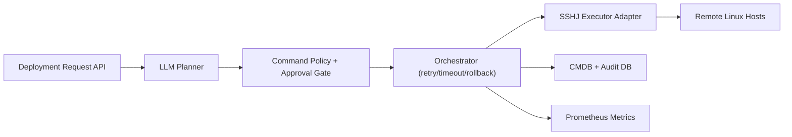

# AI-Assisted Linux Deployment Orchestrator (Java)

## What this project is (simple)
This is a Linux deployment automator.

You type a request like:
- `Install Docker + monitoring`

The app then:
- turns that request into deployment steps,
- runs those steps on remote machines over SSH,
- tracks each step status,
- stores logs and run results.

So this app orchestrates deployments on other machines. It does not only run itself.

## Concept
A Java tool that:
1. Takes a deployment request (example: `Install RHEL + Docker + monitoring`)
2. Uses an AI-planner layer to convert the request into deployment steps
3. Executes deployment on remote Linux VMs via SSH
4. Tracks status and logs for every step
5. Stores host/run data in a CMDB-style database model

## Tech stack
- Java 21
- Spring Boot
- Spring Data JPA
- SSHJ (SSH execution)
- PostgreSQL + Flyway
- H2 (local profile)
- Docker Compose
- Maven / Maven Wrapper
- Prometheus metrics via Spring Actuator

## Important: two different command types
### 1. Run-the-app commands (on your own machine)
- `./mvnw spring-boot:run`
- `docker compose up -d` (if using PostgreSQL mode)

### 2. Orchestrated deployment commands (run by the app on target host via SSH)
- `sudo apt-get install -y docker.io`
- `sudo systemctl enable --now docker`
- etc.

These deployment commands are generated/executed by the app as steps in a run.

## Architecture

## Quick start (new users)
### Option A: easiest (no Docker DB required)
Run with local in-memory DB profile:

```bash
./mvnw spring-boot:run -Dspring-boot.run.profiles=local
```

### Option B: PostgreSQL mode
```bash
cp .env.example .env
# fill in strong values in .env
set -a; source .env; set +a
docker compose up -d
./mvnw spring-boot:run
```

## Security defaults
- API key auth is enabled by default in PostgreSQL mode.
  - Header: `X-API-Key`
  - Value source: `AIDLO_API_KEY_VALUE`
- Deployment submission endpoint has in-memory rate limiting enabled by default.
  - `10` requests per `60` seconds per API key (fallback: client IP)
  - Note: current limiter is process-local (not shared across app instances).
- SSH host key verification is enabled by default.
- Password-based SSH auth is disabled by default.
- SSH key file paths are restricted to approved roots (`~/.ssh`, `/etc/ssh` by default).
- Default profile requires environment variables for DB credentials.
- Full audit notes: `docs/SECURITY_AUDIT.md`.
- TLS is configurable for production via `AIDLO_TLS_*` environment variables.
- Actuator health details/components are hidden by default in non-local profiles.

## Production transport security
- Run the API behind HTTPS in production.
- Option 1: terminate TLS at a reverse proxy/load balancer.
- Option 2: enable native Spring Boot TLS with:
  - `AIDLO_TLS_ENABLED=true`
  - `AIDLO_TLS_KEY_STORE=/path/to/keystore.p12`
  - `AIDLO_TLS_KEY_STORE_PASSWORD=<secret>`

## How to use the app
1. Start the app.
2. Register a host with `POST /api/v1/hosts`.
3. Submit a deployment request with `POST /api/v1/deployments`.
4. Check run details with `GET /api/v1/deployments/{runId}`.

## API walkthrough
### 1) Register a host
```bash
curl -X POST http://localhost:8080/api/v1/hosts \
  -H "X-API-Key: $AIDLO_API_KEY_VALUE" \
  -H "Content-Type: application/json" \
  -d '{
    "hostname":"local-vm-01",
    "address":"127.0.0.1",
    "sshUser":"nathan",
    "sshPort":22,
    "osFamily":"linux",
    "environment":"dev",
    "sshKeyPath":"/home/nathan/.ssh/id_ed25519"
  }'
```

### 2) Submit dry-run deployment
```bash
curl -X POST http://localhost:8080/api/v1/deployments \
  -H "X-API-Key: $AIDLO_API_KEY_VALUE" \
  -H "Content-Type: application/json" \
  -d '{
    "requestText":"Install RHEL + Docker + monitoring",
    "hostIds":["<host-uuid>"],
    "dryRun":true,
    "requestedBy":"nathan"
  }'
```

### 3) Get run details
```bash
curl -H "X-API-Key: $AIDLO_API_KEY_VALUE" http://localhost:8080/api/v1/deployments/<run-uuid>
```

### 4) Health and metrics
```bash
curl -H "X-API-Key: $AIDLO_API_KEY_VALUE" http://localhost:8080/actuator/health
curl -H "X-API-Key: $AIDLO_API_KEY_VALUE" http://localhost:8080/actuator/prometheus
```

## Currently configured planner commands
The current planner is heuristic (keyword-based) and maps requests to these commands.

- Baseline update step:
  - `sudo dnf -y update || sudo apt-get update -y`

If request contains `docker`:
- `sudo dnf -y install docker || sudo apt-get install -y docker.io`
- `sudo systemctl enable --now docker`
- rollback:
  - `sudo dnf -y remove docker || sudo apt-get remove -y docker.io`
  - `sudo systemctl disable --now docker`

If request contains `monitoring` or `prometheus`:
- `sudo dnf -y install node_exporter || sudo apt-get install -y prometheus-node-exporter`
- `sudo systemctl enable --now node_exporter || sudo systemctl enable --now prometheus-node-exporter`
- rollback:
  - `sudo dnf -y remove node_exporter || sudo apt-get remove -y prometheus-node-exporter`
  - `sudo systemctl disable --now node_exporter || sudo systemctl disable --now prometheus-node-exporter`

If request contains `rhel`:
- `cat /etc/os-release | grep -Ei 'rhel|centos|rocky|almalinux'`

Fallback when no feature keyword is found:
- `sudo sysctl -w net.ipv4.ip_forward=1`
- rollback:
  - `sudo sysctl -w net.ipv4.ip_forward=0`

Execution policy:
- Strict allowlist only: commands must match approved deployment templates.
- Non-allowlisted commands are rejected.

## AI integration status
- `LlmPlanner` is the AI-planner interface.
- Current implementation is `HeuristicLlmPlanner` (keyword-based NLP fallback).
- Architecture is ready to plug in a real LLM provider.
- `requestText` is validated to reject shell metacharacters and unsupported symbols.
- Every generated command is still validated by strict allowlist policy before execution (including rollback commands).
- Allowlist enforcement happens in the orchestration execution path right before SSH execution, so planner swaps still pass the same policy gate.
- Any future real-LLM adapter must use the same policy gate; non-allowlisted output is rejected.

## Project structure
- `src/main/java/com/nathan/aidlo/cmdb` - host/run/step entities and repositories
- `src/main/java/com/nathan/aidlo/orchestration` - orchestration workflow + APIs
- `src/main/java/com/nathan/aidlo/llm` - planner abstraction and planner implementation
- `src/main/java/com/nathan/aidlo/ssh` - SSH execution adapter
- `src/main/resources/db/migration` - Flyway schema migrations

## Clone and run dependencies
After cloning, dependencies are pulled automatically by Maven Wrapper:

```bash
./mvnw test
```

Or run directly:

```bash
./mvnw spring-boot:run -Dspring-boot.run.profiles=local
```
