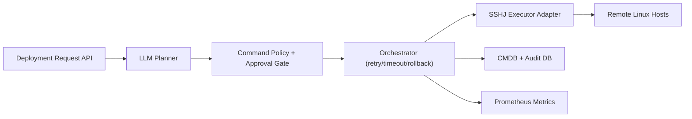

# AI-Assisted Linux Deployment Orchestrator (Java)

AI-assisted infrastructure orchestration service that converts natural-language deployment requests into audited execution runs across remote Linux hosts.

## What this MVP includes
- Deployment API that accepts requests like `Install RHEL + Docker + monitoring`
- Planner abstraction (`LlmPlanner`) with a heuristic fallback implementation
- Real SSH execution adapter via SSHJ (password or key-path auth)
- Safety controls: dry-run mode, approval gate, command policy blocking
- Retry, timeout, and rollback strategy in orchestration flow
- CMDB-style PostgreSQL schema for hosts, runs, steps, artifacts, drift, and audit events
- Prometheus metrics endpoint via Spring Actuator

## Architecture


## Package structure
- `/Users/nathan/AI-Assisted Linux Deployment Orchestrator (Java)/src/main/java/com/nathan/aidlo/api` reserved for future API modules
- `/Users/nathan/AI-Assisted Linux Deployment Orchestrator (Java)/src/main/java/com/nathan/aidlo/cmdb` entities, repositories, host API
- `/Users/nathan/AI-Assisted Linux Deployment Orchestrator (Java)/src/main/java/com/nathan/aidlo/orchestration` orchestration service and deployment API
- `/Users/nathan/AI-Assisted Linux Deployment Orchestrator (Java)/src/main/java/com/nathan/aidlo/llm` planner interface + provider implementations
- `/Users/nathan/AI-Assisted Linux Deployment Orchestrator (Java)/src/main/java/com/nathan/aidlo/ssh` SSH execution abstraction + SSHJ adapter
- `/Users/nathan/AI-Assisted Linux Deployment Orchestrator (Java)/src/main/java/com/nathan/aidlo/policy` safety policy services
- `/Users/nathan/AI-Assisted Linux Deployment Orchestrator (Java)/src/main/java/com/nathan/aidlo/audit` immutable audit event model

## Local run
1. Start PostgreSQL:
```bash
docker compose up -d
```
2. Run tests:
```bash
./mvnw test
```
3. Run app:
```bash
./mvnw spring-boot:run
```

## API examples
### Register host (key auth)
```bash
curl -X POST http://localhost:8080/api/v1/hosts \
  -H "Content-Type: application/json" \
  -d '{
    "hostname":"rhel-vm-01",
    "address":"10.0.0.21",
    "sshUser":"ec2-user",
    "sshPort":22,
    "osFamily":"rhel",
    "environment":"prod",
    "sshKeyPath":"/home/nathan/.ssh/id_ed25519"
  }'
```

### Register host (password auth)
```bash
curl -X POST http://localhost:8080/api/v1/hosts \
  -H "Content-Type: application/json" \
  -d '{
    "hostname":"ubuntu-vm-01",
    "address":"10.0.0.22",
    "sshUser":"ubuntu",
    "sshPort":22,
    "osFamily":"ubuntu",
    "environment":"dev",
    "sshPassword":"replace-me"
  }'
```

### Submit deployment (dry-run)
```bash
curl -X POST http://localhost:8080/api/v1/deployments \
  -H "Content-Type: application/json" \
  -d '{
    "requestText":"Install RHEL + Docker + monitoring",
    "hostIds":["<host-uuid>"],
    "dryRun":true,
    "requestedBy":"nathan"
  }'
```

### Submit deployment (real execution)
```bash
curl -X POST http://localhost:8080/api/v1/deployments \
  -H "Content-Type: application/json" \
  -d '{
    "requestText":"Install Docker + monitoring",
    "hostIds":["<host-uuid>"],
    "dryRun":false,
    "requestedBy":"nathan",
    "approvedBy":"ops-lead"
  }'
```

### Read run details
```bash
curl http://localhost:8080/api/v1/deployments/<run-uuid>
```

### Prometheus scrape endpoint
```bash
curl http://localhost:8080/actuator/prometheus
```

## Notes
- Real SSH execution is implemented in `/Users/nathan/AI-Assisted Linux Deployment Orchestrator (Java)/src/main/java/com/nathan/aidlo/ssh/SshjSshExecutor.java`.
- Execution policy config is in `/Users/nathan/AI-Assisted Linux Deployment Orchestrator (Java)/src/main/resources/application.yml` under `aidlo.execution`.
- Flyway migrations are in `/Users/nathan/AI-Assisted Linux Deployment Orchestrator (Java)/src/main/resources/db/migration`.
